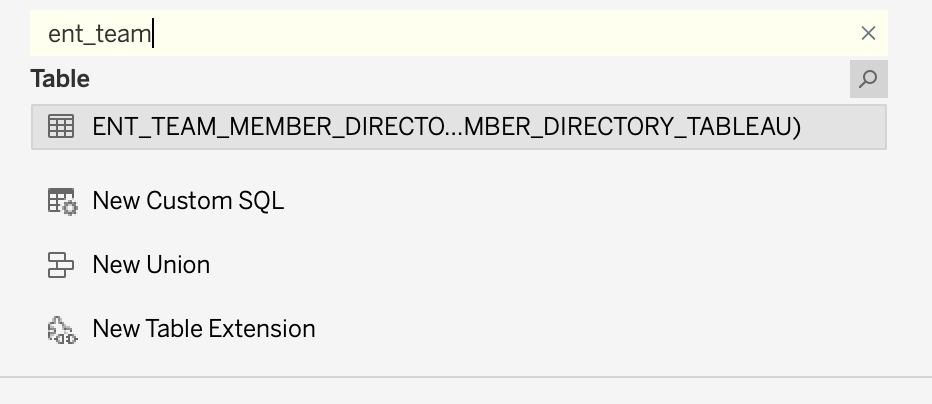
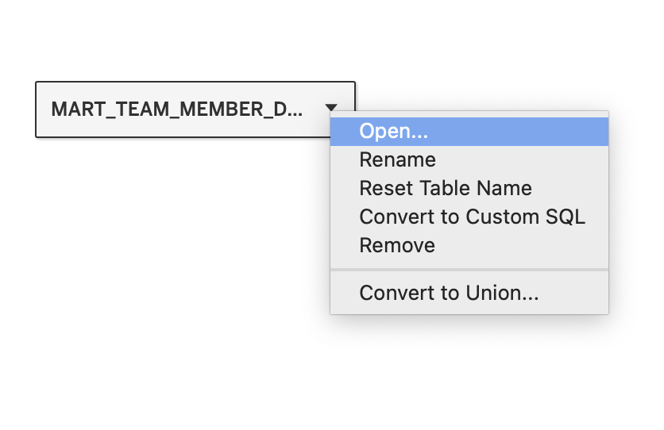
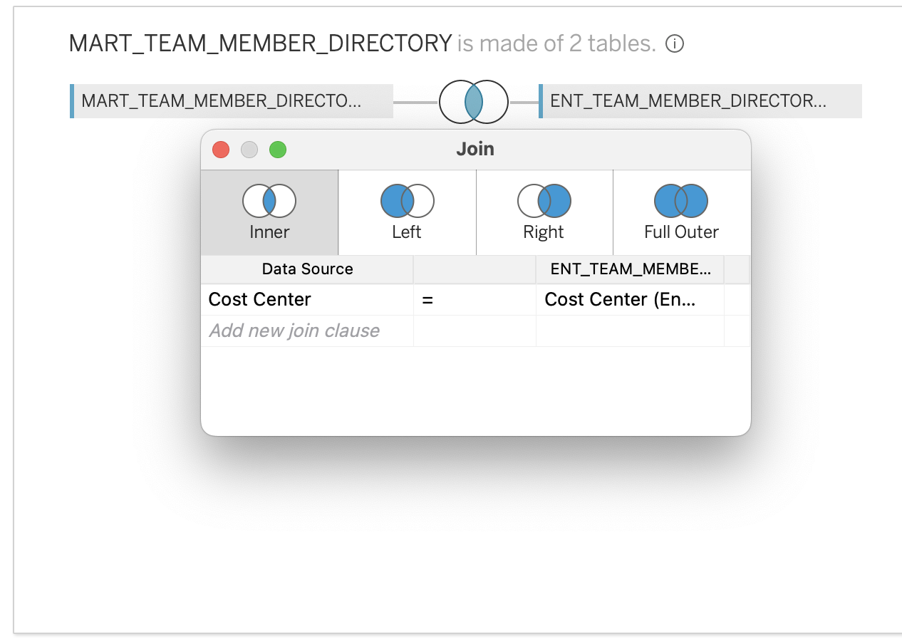
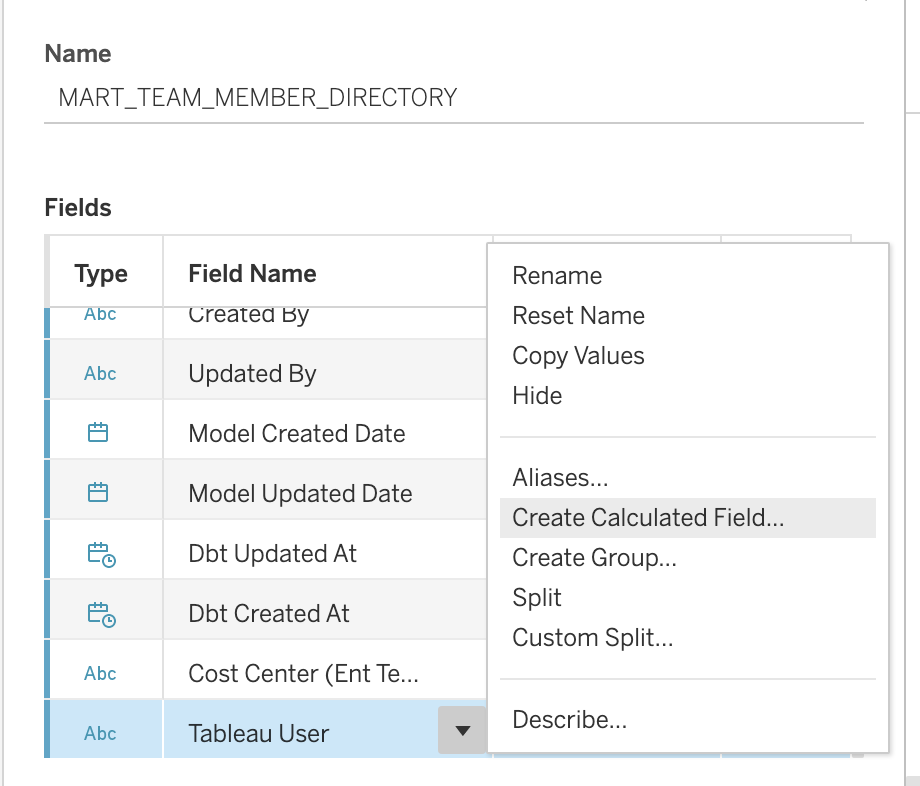

## On this page
{:.no_toc .hidden-md .hidden-lg}

- TOC
{:toc .toc-list-icons .hidden-md .hidden-lg}

---

## Row Level Security

To use Row Level Security within Tableau the developer will need to use an entitlement table, found in `prod.entitlement`.  The entitlement table will be joined with the appropriate source table using the Tableau Data Modeling interface; this ensures that the tables can be properly filtered at query time and will allow for extracts to properly implement row level security.  Once the entitlement table is joined to to corresponding source table, a data source filter needs to be added to ensure the rows are correctly filtered to the current user. 

### Example

Find the correct entitlement table for the table you are using.  The entitlement table should be named similar to the table you wish to join it to.

Perform a direct inner join, not a relationship, between the source table and the entitlement table. 

Create a Data Source filter using the `USERNAME()` function and the `tableau_user` filed in the entitlement table.  This is the step that will ensure that only rows visible to the current user will be retrieved.

