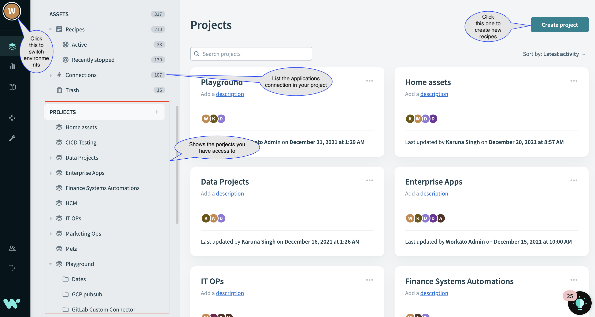

{::options parse_block_html="true" /}

<link rel="stylesheet" type="text/css" href="/stylesheets/biztech.css" />

## Integrations - Workato Playbook

### How to get the access?
To get started with Workato, please create an [access request](https://about.gitlab.com/handbook/business-technology/team-member-enablement/onboarding-access-requests/access-requests/#individual-or-bulk-access-request) and assign it to @dparker or @karuna16. In the the AR, please mention the follwoing details:

- [ ] your orgnisational team
- [ ] workato environment - dev, test or prod.
- [ ] why do you need the access?

#### Types of Roles/Accesses available in Workato
Currently, we have two classifactions of roles per team in Workato:
1. **Team Admin**: To Create, Edit, Deploy, Run/Stop recipes. Like Marketing Admin.
2. **Team Ops**: To view, run/stop recipes. Like Marketing Ops.

Please **note** the accesses are configurable as per team and use case basis.

### Getting Started with Workato
Once the AR is approved and closed, you'll see the Workato app in your Okta home page. _Please refresh the Okta home page, in case you cannot find the app_. There're 3 Workato apps in Okta for each of the environment, based on your request, you'll see those ones in Okta.

On clicking the app, you'll land up in the Workato home page. Click on anyone of the project plate, and you're good to start creating or editing recipes.

