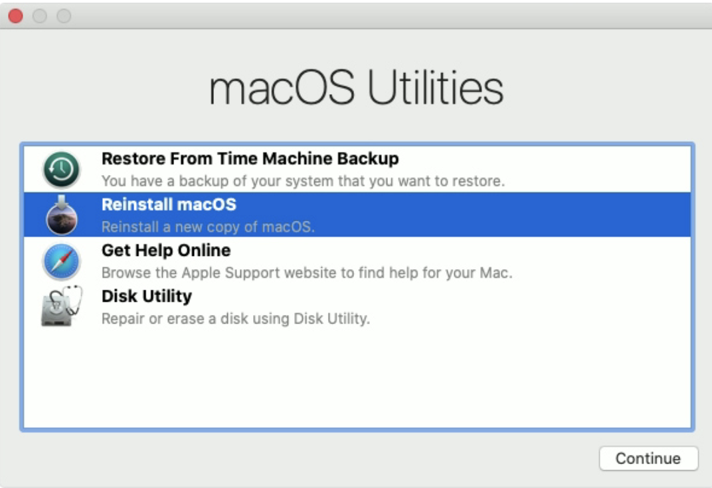
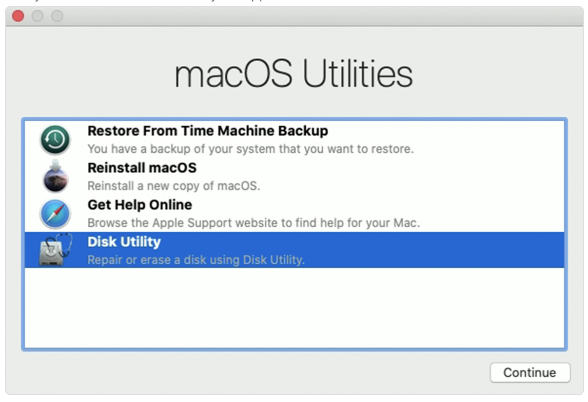
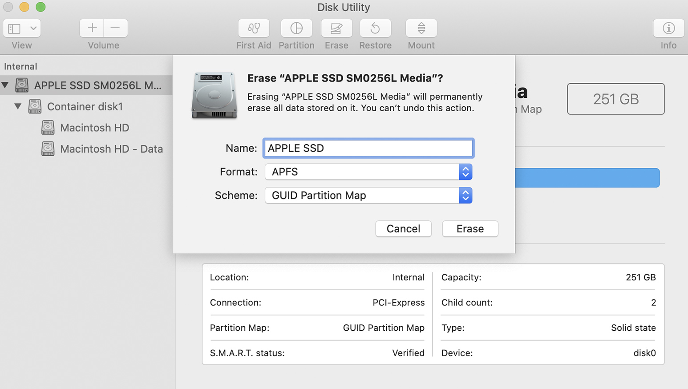
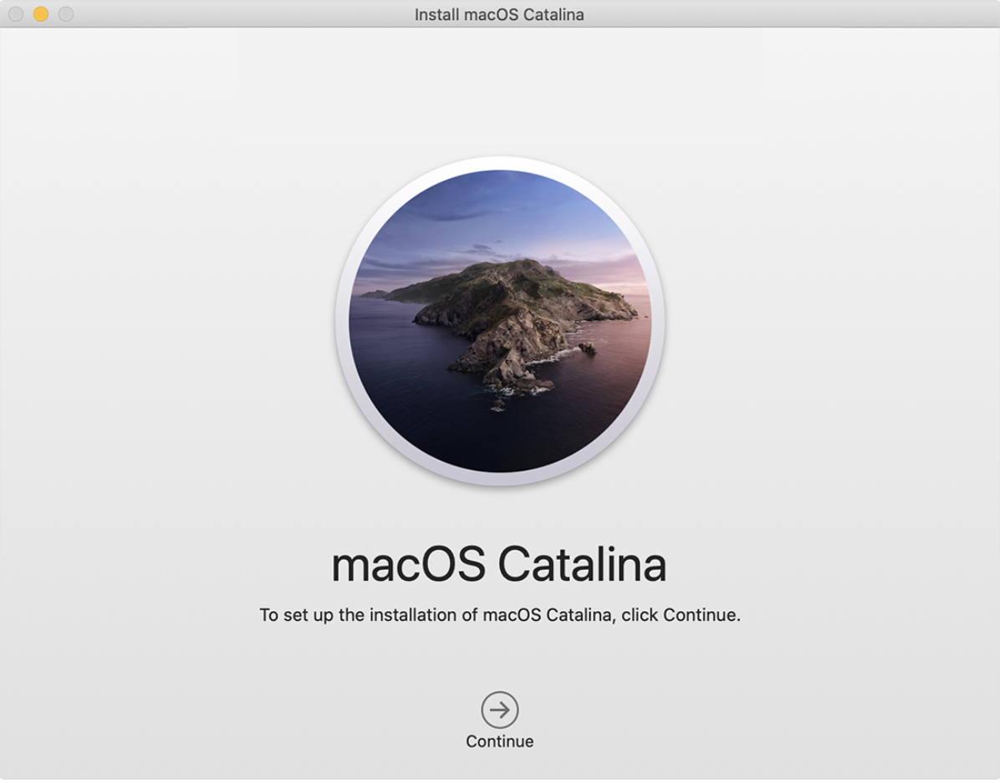

<link rel="stylesheet" type="text/css" href="/stylesheets/biztech.css" />

## On this page
{:.no_toc .hidden-md .hidden-lg}

- TOC
{:toc .hidden-md .hidden-lg}

Please read through this page to find the most common questions GitLab team members encounter. If you cannot find an answer to your question, please find more information on how to contact us at the bottom of the page. If the team has provided you with an answer that isn't listed here, please submit an MR to add it!

## <i class="fas fa-question-circle" id="biz-tech-icons"></i> Frequently asked questions

### Getting a new phone or need to reset your 2FA for GitLab and other tools

For 2FA related problems for your GitLab accounts, please use your backup codes or try generating [new ones](https://docs.gitlab.com/ee/user/profile/account/two_factor_authentication.html#generate-new-recovery-codes-using-ssh).

Follow these steps to successfully set up 2FA for your [Google account](https://support.google.com/accounts/answer/185839?co=GENIE.Platform%3DDesktop&hl=en).

Follow these steps to reset your 2fa for [Okta](https://about.gitlab.com/handbook/business-technology/okta/#i-changed-my-phone-and-now-cant-do-mfa-what-do-i-do)

When you get a new device, before you get rid of the old one, make sure to set up your authenticator app on the new device.
You will need to log into your accounts with the old device and disable 2FA for your accounts.
Then delete the accounts off the old device and re-enable the 2FA on your accounts on the authenticator app on the new device.
If you still need a 2FA reset, please reach out to #it_help on slack with the system that needs it and the issue you are encountering.

### Forgot my password

We understand sometimes life happens and passwords get forgotten or deleted.
If it is for a system that requires immediate access, please reach out on the slack #it_help channel.
Provide as much information as possible.
Password resets to sensitive systems such as your Google Workspace account and Okta require a zoom call to verify.

### Using GMail app on phone with Okta log in

Please refer to our GitLab Accceptable Use Policy on [Personal Phones Mobile Phone and Tablet Usage](https://about.gitlab.com/handbook/people-group/acceptable-use-policy/#personal-mobile-phone-and-tablet-usage) prior to adding your GitLab GMail account to your personal device. 

To have GMail on your phone now that it is controlled by Okta, you must use the actual Google Apps. 
- Download GMail to your phone
- Add Google account
- Input your GitLab email
- Google will redirect to Okta login. Input your Okta username
- Input Okta password
- All set!

### New to Mac?

A lot of people coming onboard to GitLab have had some sort of exposure to macOS and Apple hardware, if you are one of those people the below link is probably not for you but you still might learn something!

- [Mac tips for Windows switchers](https://support.apple.com/en-us/HT204216)
- [Mac Keyboard Shortcuts](https://support.apple.com/en-us/HT201236) - great to help your productivity!
- [macOS : Catalina New Features](https://www.apple.com/au/macos/catalina/features/) - Apple's newest OS features
- [Got an iPad? - Check out Sidecar!](https://support.apple.com/en-afri/HT210380) - Apple iPad Sidecar
- [How to use multiple workspaces on Mac](https://support.apple.com/guide/mac-help/work-in-multiple-spaces-mh14112/mac)

### How to Erase a Disk for Mac

If you are keeping your GitLab machine [Laptop Buy Back Policy](/handbook/business-technology/team-member-enablement/onboarding-access-requests/#laptop-buy-back-policy) it is required that IT wipes the machine and restores it to base OS. We currently use 2 products to accomplish this task and you can read more about this here - [Remote Wipe procedure](https://about.gitlab.com/handbook/business-technology/team-member-enablement/onboarding-access-requests/#fleet-intelligence--remote-lockwipe). If however you just wish to reinstall macOS and want to start with a clean slate then these instructions will help you accomplish this.

[How to erase a disk](https://support.apple.com/en-us/HT208496)

## Self-Help and Troubleshooting Tips

This section should provide some quick and easy troubleshooting tips anyone can do to possibly remedy an IT issue before reaching out.
This section will be expanding over time so keep an eye out or feel free to contribute if you think something belongs.

### Built-In MacBook Troubleshooting Commands

MacBooks are wonderful laptops, but no laptop is without faults.
You may come across a "wonky" situation with your Mac, so below are some pointers that may help fix common issues.

- Reset your [NVRAM and PRAM](https://support.apple.com/en-us/HT204063) - non-volatile random access memory and parameter RAM stores small amount of information on your Mac, if you experience issues related to what's in the Apple article resetting this might help out.
- Reset the [SMC](https://support.apple.com/en-us/HT201295) - System Management Controller handles some low-level functions like battery management and if you experience issues with fans or internal ports this could help resolve those issues.
    (Note: different models have different reset methods)
- Apple Diagnostics [Hardware Diagnostics](https://support.apple.com/en-us/HT202731)

### Password Reset for Your MacBook

Did you go out for a long well deserved vacation and come back to a completely blank memory on what your laptop password was?
It happens to the best of us!
Apple has you covered.

- Power down the Mac.
- Restart the Mac while also concurrently holding down the Command + R keys (to go to recovery mode); release the keys when Apple logo appears
- Once Mac is restarted select from the menu Utilities > Terminal
- At the window that opens, type `resetpassword`
- Follow onscreen instructions to reset

### Battery Cycle Count

Want to see the health of your battery? Generally the laptops that we use have a maximum battery cycle life of 1000, you can check it below

- Battery Cycle Count [Battery Cycle Count](https://support.apple.com/en-us/HT201585)

### Repair a Disk or Mac Storage Drive

Apple's Disk Utility tool can fix some problems such as applications unexpectedly quitting or crashing, corrupted files, and external drives not working.
You can also format drives with Disk Utility.

This is a quick walkthrough on how to check your MacBook's disk and run First Aid.

- If you don't want to reboot the laptop, open Spotlight and search `disk utility`
- In the Disk Utility App, select your disk (should be named Macintosh HD but you can change that too)
- At the top you will see `First Aid`, click that an hit `run`
- Your MacBook will run First Aid, report any issues, and correct them if it can

### How long is my MacBook in Warranty?

- Review your Apple Warranty Status [Service and Support](https://checkcoverage.apple.com/)

### Want to add different profiles for your different GitLab accounts?

It is recommended that you create different profiles in Chrome so you can manage your different GitLab accounts.
This way you can easily sign in without having to signout out of different accounts each time.
A lot easier if you've got `staging.gitlab.com` and `dev.gitlab.org` accounts.

- On your computer, open Chrome
- At the top right, click the `Profile Profile`
- Click `Add`
- Choose a name and a photo
- Click `Add`.
- A new window will open and ask you to turn on sync

### Is your Chrome browser acting a little weird?

If you are having issues that seemingly can't be explained the below steps might help resolve your issue.
Keep in mind this will reset chrome to default settings but its easy enough to restore and link data back.

- On your desktop, open Chrome
- At the top right, click `More` and then `Settings`
- At the bottom, click `Advanced`
- Linux, and Mac: Under `Reset Settings`, click `Restore settings to their original defaults` and then `Reset Settings`

### Does your Gmail account keep getting suspended?

This usually occurs when the emails you send out get reported for spam. Collect too many reports and Google will automatically suspend your account. Here is some more info on Google's [page](https://support.google.com/a/topic/28609).

**How do I get access to my account after suspension?**

Someone from IT will need to unlock your account. Please submit a [Team Member Enablement request](https://gitlab.com/gitlab-com/business-technology/team-member-enablement/issue-tracker/-/issues/new?issuable_template=General%20HelpDesk%20Request) or reach out to us on the #it-help slack channel.

**How do I prevent this from happening?**

Please look into the following mailing applications which may prevent this from happening in the future due to a different mailing method.

- MailGun: <https://www.mailgun.com/>
- MailChimp: <https://mailchimp.com/>

Both of those applications are listed in GitLab's tech stack meaning they can be used.

### Questions about Okta?

Want to know how as an organization we leverage Okta as a Single Sign On tool? Please click [here](/handbook/business-technology/okta/)

### Tools and Tips

Check out the GitLab Tools and Tips pages for recommended software and applications - [Tools and Tips](/handbook/tools-and-tips/)

Our security team also did an amazing write-up for Linux installations - [Linux Setup](/handbook/tools-and-tips/linux/)

### Using JAMF Self Service to Update your OS

You can easily use JAMF's Self Service tool to update your Mac to the OS you need to update to. To do this follow the below instructions

1. Head to Finder on your Mac and select Applications
2. Click on Self Service
3. On the left hand side you'll see OS Updates

4. From here you'll have 2 options, either the last version of MacOS Catalina (10.15.7) or the newest version of MacOS Big Sur. Click on the one you wish to install. Please note you cannot downgrade to lower OS
5. This can take upwards of an hour, so please factor in that time when you are updating

### Reinstalling Mac OS after a JAMF wipe

We use JAMF to wipe laptops when you're either getting a new laptop, sending it back to our supplier 'Sell your Mac' or retaining your laptop after you have left the company (https://about.gitlab.com/handbook/business-technology/team-member-enablement/onboarding-access-requests/#laptop-buy-back-policy)

After we have initiated the wipe from our end. You will need to reinstall macOS so your computer can boot properly. Please follow the below instructions.

1. Start up from macOS Recovery
To start up from macOS Recovery, turn on your Mac and immediately press `Command + R` on your keyboard. Release the keys when you see an Apple logo or Spinning Globe.

When you see the utilities window, you have started up from macOS Recovery.

2. Install macOS
When you're ready to reinstall macOS, choose Reinstall macOS from the Utilities window. Then click Continue and follow the on-screen instructions. You will be asked to choose a disk on which to install.

- If the installer asks to unlock your disk, enter the password you use to log in to your Mac.
- If the installer can't see your disk, or it says that it can't install on your computer or volume, you might need to erase your disk first

You can do this by going back to the Utilities window and clicking on `disk utility`

Choose View > Show All Devices from the menu bar in Disk Utility. The sidebar now shows your disks (devices) and any containers and volumes within them. The disk your Mac started up from is at the top of the list. In this example, Apple SSD is the startup disk:

Select the disk you want to erase.
Click Erase, then complete these items:

Name: Type the name that you want the disk to have after you erase it.
Format: Choose APFS or Mac OS Extended (Journalled). Disk Utility shows a compatible format by default.
Scheme: Choose GUID Partition Map.

Click Erase to begin erasing your disk and every container and volume within it. You may be asked to enter your Apple ID. When it's finished, quit Disk Utility.

Once this is complete you can then install OS by clicking on Reinstall macOS from Utilities window again and selecting the disk you've just wiped. Follow the prompts and the OS will install

## Enrolling your Chromebook into GitLab Google Device Management

1. Turn on your Chromebook and follow the on-screen instructions until you see the sign-in screen. Don't sign in yet.
2. Choose an option to get to the enrollment screen: Press Ctrl+Alt+E. Click More options and then Enterprise enrollment (not available on Chromebook tablets).
3. Enter the username and password from your Google admin welcome letter or for a Google Account that has eligibility to enroll. This is your GitLab username and password.
4. If prompted, enter the asset ID and location and click Next.
5. When you get a confirmation message that the device is successfully enrolled, click Done.

## Can't find what you are looking for?

Request for support should have an issue open at [IT Help Issues](https://gitlab.com/gitlab-com/business-technology/team-member-enablement/issue-tracker/-/issues/new?issuable_template=General%20HelpDesk%20Request).

### How to Contact Us or Escalate Priority Issues Outside of Standard Hours

We ask that all requests are made through an [IT Help Issue](https://gitlab.com/gitlab-com/business-technology/team-member-enablement/issue-tracker/-/issues/new?issuable_template=General%20HelpDesk%20Request). We will triage and address them as soon as we can. All issues created in the queue are public by default. Privileged or private communications should be sent to [it-help@gitlab.com.](mailto:it-help@gitlab.com.) Screenshots and videos are very helpful when experiencing an issue, especially if there is an error message.

As a distributed team, we have support around the clock with team members in North America, Europe and Australia.
High volumes of issues being triaged can dictate the delay in response within that window. If the issue is extremely time sensitive and warrants escalation, use judgement on whether or not it can wait until ‘business hours’.
Escalated issues should be made through the #it_help slack channel.
All other request should have an issue created.
