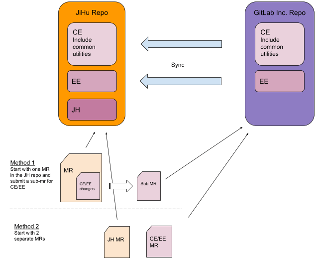

## On this page
{:.no_toc .hidden-md .hidden-lg}

- TOC
{:toc .toc-list-icons .hidden-md .hidden-lg}

{::options parse_block_html="true" /}

----

## Overview

As announced in the blog post [GitLab licensed its technology to new independent Chinese company](https://about.gitlab.com/blog/2021/03/18/gitlab-licensed-technology-to-new-independent-chinese-company/), GitLab Inc. has licensed its technology to JiHu. This page is outlines how the GitLab Inc. team provides support to JiHu. 

## Brand

Please refer to our [guidelines](https://docs.google.com/document/d/1oJd_3SMHlTod6j3ThqhjpeCyyw8rqBM4WUeOfy7vYKs/edit?usp=sharing)

## Communications

Please refer to our [guidelines](https://docs.google.com/document/d/1SEBkJp0R-yjN654KTJjcSI55VGwWPHN2xTKLW5FNvUM/edit?usp=sharing)

## Sales

Please refer to our [guidelines](https://docs.google.com/document/d/1JigQn7g8KUrY8N6WHuf248ARWHzCpIGhE2yXriuhI5c/edit?usp=sharing).

## Professional Services

Please refer to our guidelines (link to be added).

## Customer Support

Process to be added below.

## Engineering

### Projects

| GitLab Inc Project                                      | JiHu Project                                               |
|---------------------------------------------------------|------------------------------------------------------------|
| https://gitlab.com/gitlab-org/gitlab                    | https://gitlab.com/gitlab-jh/gitlab                        |
| https://gitlab.com/gitlab-org/license-gitlab-com        | https://gitlab.com/gitlab-jh/license-gitlab-cn             |
| https://gitlab.com/gitlab-org/customers-gitlab-com      | https://gitlab.com/gitlab-jh/customers-gitlab-cn           |
|                                                         | https://gitlab.com/gitlab-jh/cookbook-customers-gitlab-com |
| https://gitlab.com/gitlab-services/version-gitlab-com   | https://gitlab.com/gitlab-jh/version-gitlab-cn             |
| https://gitlab.com/gitlab-jh/omnibus-gitlab             | https://gitlab.com/gitlab-jh/omnibus-gitlab                |
| https://gitlab.com/gitlab-jh/gitlab-environment-toolkit | https://gitlab.com/gitlab-jh/gitlab-environment-toolkit    |
| https://gitlab.com/gitlab-org/build/CNG                 | https://gitlab.com/gitlab-jh/cng-images                    |
| https://gitlab.com/gitlab-org/charts/gitlab             |                                                            |
| https://gitlab.com/gitlab-com/www-gitlab-com            | https://gitlab.com/gitlab-jh/jh-team/www-gitlab-com        |
| https://gitlab.com/gitlab-org/gitlab-docs               |                                                            |
| https://gitlab.com/gitlab-org/gitlab-runner             |                                                            |

### Merge Request Process

We are working towards establishing a code sync between GitLab, Inc. and GitLab JH repositories. The team will be working in the following methods. 

JH changes to JH folder in the mirrored repo. Potentially 2 ways.
* Method 1. -- Start with 1 MR in the `GitLab-JH` repository, once reviewed and approved for merge, create a separate MR for CE/EE only changes to the main `gitlab-org\GitLab` repository
* Method 2. -- Split out the task one MR for CE/EE and one for JH. This needs a full understanding of the architecture and will take time. We can only work in this structure after the launch on `2021-03-18` because we cannot expose this information in the public before that.

We will be using on Method 1. In the short term for the following reasons
* Ensure no leaks of content
* Ensure single context of reviewing 

As the team gets more familiar we will move to Method 2. To get to this we will need to make sure the following building blocks are present:
* Code structure helpers
  * CI configuration with JH-
  * Helper functions with JH::
  * Rails prepend/inflect mechanisms
  * Helper functions for lib and specs
* Identify and educate the broader team on code patterns 
  * What code in CE/EE will look like when a corresponding MR in `GitLab-JH` is present.
  * Publish documentation and guidelines 
  * Ensure that maintainers are aware and can be productive in reviewing code
* Enable code mirroring and sync 

 

### Current Guidelines

* Ensure that you rebase from upstream `gitlab-org\GitLab` when we don't have code mirror in place. 
* Merge the merge request into `main-jh` branch directly, without having it goes to `master` first.
* When the needed changes merged into `master`, then rebase `main-jh` onto master. If the changes are identical, this process should go smoothly, and everything should follow the usual process onward.
* If there are different changes, resolve the conflicts by picking the changes from `master`, discard any specific changes originally in `main-jh`, and create a new merge request to adopt the new changes accordingly for main-jh.
* Use gitlab.cn rather than jihulab.com for external communication.
* Keep an eye out on how to structure JH code changes in the future that can be contained inside the `JH/` folder. e.g. via flags https://gitlab.com/gitlab-jh/gitlab/-/merge_requests/6

### Security Release Process

JiHu is responsible for building and releasing the JiHu Edition each month including all patch and security releases. For security releases, GitLab Inc will continue to follow our existing [security release process](https://gitlab.com/gitlab-org/release/docs/blob/master/general/security/process.md) to publish our [security releases](https://about.gitlab.com/releases/categories/releases/). To enable JiHu to build their security releases in a timely manner, GitLab Inc will notify JiHu when a security release is in progress along so that their teams can be on stand by. GitLab Inc will not notify JiHu of the contents of the security release or of the vulnerability.

To notify JiHu of an upcoming security release, please simply post a comment in: https://gitlab.com/gitlab-jh/gitlab-jh-enablement/-/issues/112

## Product

### Differentiating Proprietary JiHu Features
We differentiate proprietary features for JiHu distributions by including them in the `/jh` [directory](https://gitlab.com/gitlab-jh/gitlab/-/tree/main-jh/jh). However, the majority of contributions from JiHu team members should be outside of the `/jh` directory signaling the expectation that most contributions are to GitLab Core and only certain specific features are exclusive to the /jh offering.

## Design 

Process to be added below.

## Links 

- [GitLab licensed its technology to new independent Chinese company](https://about.gitlab.com/blog/2021/03/18/gitlab-licensed-technology-to-new-independent-chinese-company/)
- [GitLab licensing technology to independent Chinese company FAQ](https://about.gitlab.com/handbook/faq-gitlab-licensing-technology-to-independent-chinese-company/)
- [China Service Working Group](https://about.gitlab.com/company/team/structure/working-groups/china-service/)
