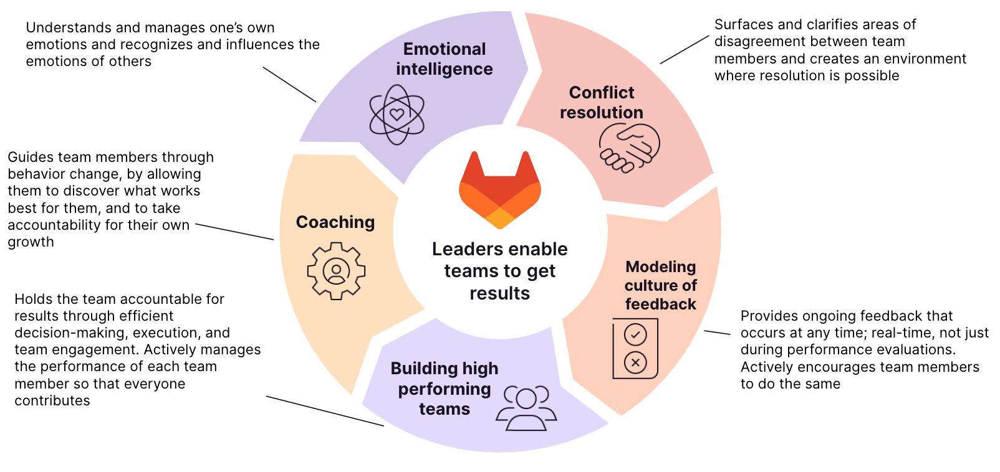

## On this page
{:.no_toc .hidden-md .hidden-lg}

- TOC
{:toc .hidden-md .hidden-lg}

## Intro

GitLab has competencies as a common framework to learn things. This page is a [Single Source of Truth (SSoT)](https://docs.gitlab.com/ee/development/documentation/styleguide/#why-a-single-source-of-truth) resource for our competencies.

A competency is defined as a set of skills, knowledge, and behaviors that allow an individual to effectively and efficiently carry out their role. There are three key categories of competencies at GitLab:

*  Values Competencies - a common set of behaviors and skills that reflect the organizational [values](/handbook/values/) needed across the workforce
*  Remote Competencies - the skills and knowledge required to perform in an all-remote environment
*  Functional Competencies - the skills, knowledge, and behaviors required to perform at the functional level

## Principles

1. We will re-use the same materials for different audiences by having them on a [Single Source of Truth (SSoT)](https://docs.gitlab.com/ee/development/documentation/styleguide/#why-a-single-source-of-truth) competency page
1. We will make competencies accessible to everyone in the world, including knowledge assessments, to validate understanding a competency (via Google forms and Zapier)
1. We will work handbook first so [everyone can contribute](https://about.gitlab.com/company/mission/#mission)

 <!-- blank line -->
 <figure class="video_container">
   <iframe src="https://www.youtube.com/embed/oXTZQpICxeE" frameborder="0" allowfullscreen="true"> </iframe>
 </figure>
 <!-- blank line -->

## Where we use competencies

The following initiatives should use the same competencies as their SSoT.
Instead of maintaining separate materials they should link back to the most relevant place where the competency is defined. For general competencies, this is likely our [values](/handbook/values/) page. For role specific competencies, this is likely the [job-family](/handbook/hiring/job-families/#format) page.
For example, we should have one SSoT for how to articulate the value of GitLab.

1.  [Job family requirements](/handbook/hiring/job-families/#format)
1.  [Interview scoring](/handbook/hiring/talent-acquisition-framework/hiring-manager/#step-12hm-complete-feedback-in-greenhousenext-steps)
1.  [Promotion criteria](/handbook/people-group/promotions-transfers/)
1.  [9 box assessments](https://www.predictivesuccess.com/blog/9-box/)
1.  [Performance/Potential criteria](/handbook/people-group/performance-assessments-and-succession-planning/#the-performancepotential-matrix)
1.  [Succession planning](/handbook/people-group/performance-assessments-and-succession-planning/#succession-planning)
1.  [Learning and development](/handbook/people-group/learning-and-development/)
1.  [PDPs/PIPs](/handbook/leadership/underperformance/)
1.  [Career development](/handbook/people-group/learning-and-development/career-development/)
1.  [360 reviews](/handbook/people-group/360-feedback/)
1.  [Sales training](/handbook/sales/training/)
1.  [Sales enablement sessions](/handbook/sales/training/sales-enablement-sessions/)
1.  [Field enablement](/handbook/sales/field-operations/field-enablement/)
1.  [GitLab Training tracks](/learn/)
1.  [GitLab University](https://docs.gitlab.com/ee/university/)
1.  [Customer Success Skills Exchange Sessions](/handbook/sales/training/customer-success-skills-exchange/)
1.  [Professional services offerings](/handbook/customer-success/professional-services-engineering/framework/#service-offering-framework/)
1.  [Onboarding](/handbook/people-group/general-onboarding/) both general and department specific
1.  [Learn@GitLab](/learn/)
1.  [Customer Success GitLab Demos platform & catalog](https://gitlabdemo.com/)
1.  [Customer Services Guided Explorations](https://gitlab.com/guided-explorations) ([How Guided Explorations are engineered for compounded reuse for competency development](https://gitlab.com/guided-explorations/guided-exploration-concept/-/blob/master/README.md))
1.  [Udemy course](https://www.udemy.com/gitlab-for-beginners/)
1.  [Education service offering](https://about.gitlab.com/services/education/)

## Content

1. Content is in the relevant section of our handbook (with embedded videos and pictures)
1. Knowledge assessments are created in Google Forms (via Zapier)
1. The [leadership forum](/handbook/people-group/learning-and-development/leadership-forum/) is organized by L&D

## Structure
Some competencies are based on job-level and others are based on your role.

Values competencies are defined by job-level. For example, the definition of competency in the GitLab value of iteration and how you demonstrate that competency are different whether you are an Intermediate Product Manager or a Chief Product Officer.

In general, the scope of impact and expected behaviors expands as job level increases.

| Level | Scope of Impact | Expected Behaviors |
|-----------------|----------------------------------------|------------------------------------------|
| Associate | Own work | Learns/Develops |
| Intermediate | Work within team | Grows/Acts |
| Senior | Cross functional work | Models |
| Staff/Manager | Across Teams | Implements |
| Senior Manager | Across Sub-Departments | Fosters |
| Director | Across Departments | Drives the framework, strategy and plans |
| Senior Director | Across Divisions | Develops the framework and strategy |
| VP | Across Company + External Stakeholders | Leads Changes |
| EVP/CXO | Across Company + External Stakeholders | Champions  |

Remote Work Competencies are defined by role: team member or people leader. Team members should understand and apply remote work competencies to their daily work. People leaders should understand, apply, coach and develop team members on remote work competencies.

## List

Each of the values and remote work competencies have a knowledge assessment in the relevent section of the handbook that you can take to self assess your current level of understanding.

### Values Competencies
1. [Collaboration](/handbook/values/#collaboration-competency)
1. [Results](/handbook/values/#results-competency)
1. [Efficiency](/handbook/values/#efficiency-competency)
1. [Diversity, Inclusion & Belonging ](/handbook/values/#diversity-inclusion--belonging-competency)
1. [Iteration](/handbook/values/#iteration-competency)
1. [Transparency](/handbook/values/#transparency-competency)

In addition to the knowledge assessments for each value, you can take this [Knowledge Assessment](/handbook/values/#gitlab-values-knowledge-assessment) to become certified in the values.

### Remote Work Competencies
1. [Manager of One](/handbook/leadership/#managers-of-one)
1. [Effective Communication](/handbook/communication/#effective-communication-competency) : includes Working async: [Why](/company/culture/all-remote/asynchronous/) and [How](/handbook/communication/), Well written artifacts, [Single Source of Truth](/handbook/documentation/#documentation-is-the-single-source-of-truth-ssot) and [Producing video](/handbook/marketing/marketing-operations/youtube/)
1. [Handbook first](/handbook/handbook-usage/#handbook-first-competency)
1. [Using GitLab](/handbook/using-gitlab-at-gitlab/#using-gitlab-competency)

Test your knowledge and self-reflect on the Remote Work Competencies by completing the knowledge assessment as a [People Leader](https://docs.google.com/forms/d/e/1FAIpQLSemWK_Ki0aAMepKAQnaN-uMr1JBlkCs3O80sBli4PaTl2uoDA/viewform) or an [Individual Contributor](https://docs.google.com/forms/d/e/1FAIpQLScN70eoAjJ0tuj_iSgFRkyRbeNLrO9Yz52897619IkwoNW-cw/viewform). Earn at least an 80% to receive a certificate!

### Functional Competencies

1. [Field Competencies](/handbook/sales/training/field-functional-competencies/)
1. [Engineering Competencies](/handbook/engineering/career-development/matrix/engineering/)
1. [Product Competencies](/handbook/product/product-manager-role/product-CDF-competencies/)

### Manager and Leadership Competencies

In addition to our values, remote work, and functional competencies, we have identified manager competencies that serve as the foundation to a whole person approach to management. Our leadership and management development programs incorporate the competencies as the bedrock for creating impactful training for our people.

1. [Emotional Intelligence](/handbook/leadership/emotional-intelligence/)
2. [Modeling a Culture of Feedback](/handbook/people-group/guidance-on-feedback/#modeling-a-culture-of-feedback-manager-competency)
3. [Coaching](/handbook/leadership/coaching/)
4. [Conflict Resolution](/handbook/leadership/managing-conflict/)
5. [Building High Performing Teams](/handbook/leadership/#building-high-performing-teams)

{: .shadow.medium.center}
