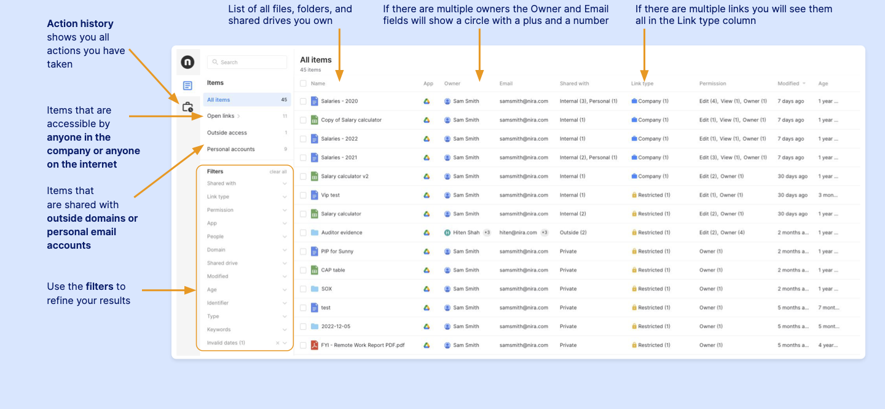
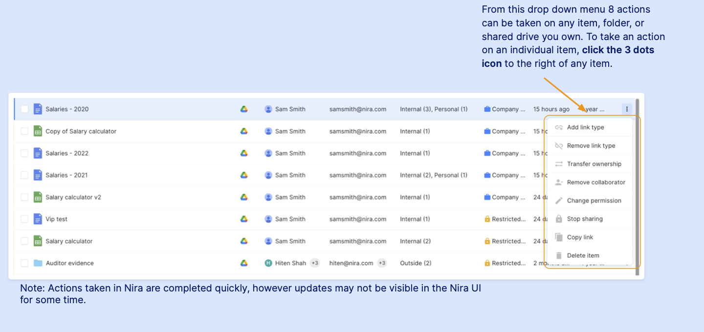
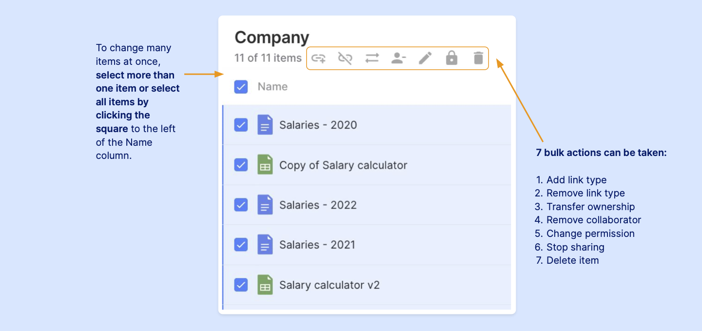
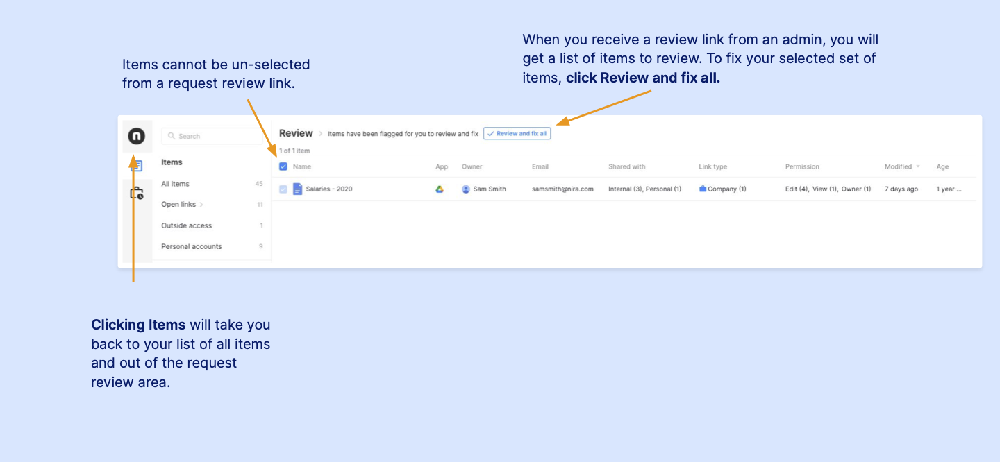
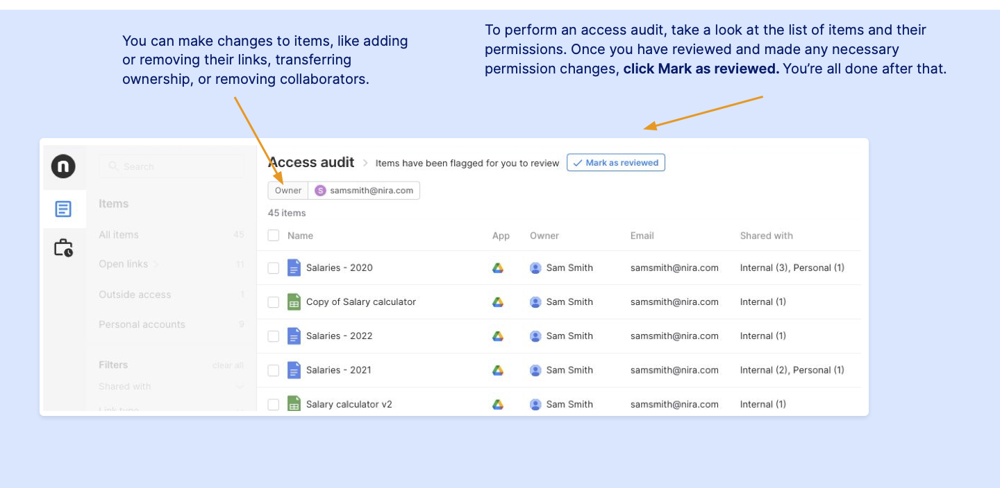
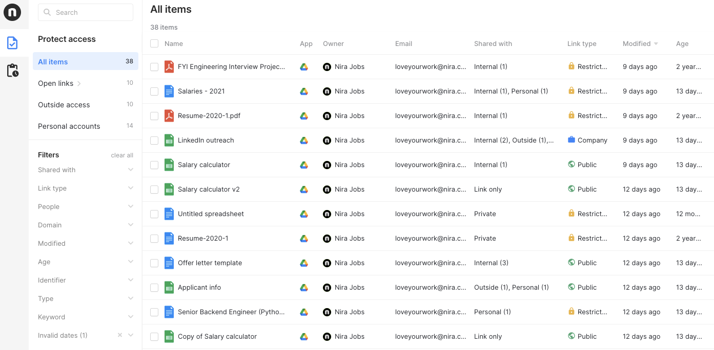
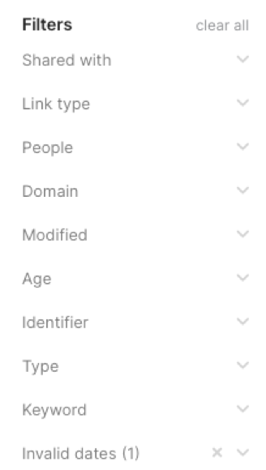

## Overview

GitLab encourages team members to use Nira to ensure good digital hygiene around who has access to their Google Drive documents, folders, and shared drives.

Nira is a real-time access control system that provides visibility and management over who has access to company documents in Google Workspace.

Nira is used by team members to be able to view and modify the sharing settings of documents that they own. Nira is also used by administrators of cloud applications, typically IT & Information Security teams, to review metadata and sharing settings of documents.

We chose Nira because of the easy to navigate interface, alerting mechanisms, flexible dashboards, and ease of use. This helps our teams respond to incidents, assist with offboarding, and help keep our Drive files secure.

"We take the security of your data seriously. Nira has also attained its International Organization for Standardization’s (ISO) 27001 certification. Nira has achieved its SOC 2 Type 2 certification and is audited annually. Security is our highest priority and is an integral part of how we operate." -- [Nira](https://nira.com/about/)

#### System Owner

- DRI: `@adamhuss`
- `#it_security_help` Slack channel

#### Access Request

- Team Members: No access request needed. Visit [https://app.nira.com/](https://app.nira.com/) and click the `Sign in with Google` button.
- Admin Users (IT and Security only): Required. See Tech Stack for provisioner details.

## Logging in to Nira

> Please note that login to Nira requires your Google work email account and password.

1. On your web browser, navigate to [Nira](https://app.nira.com).
1. Click the **Sign in with Google** button.
1. Follow the steps to enter your work email address and password.
1. You will be taken to the Nira interface.

## Protect access area

The first section to familiarize yourself with is the "Protect Access" area. as shown below. From here you can filter by file type, share permissions, and many others. You can also see meta-data information which can help you protect access to your Drive files.

## Seeing more details about an item

> Once you login to Nira, you will see a list of all the documents, shared drives, and folders you own. If you'd like to see specific details about an individual item, take the steps below.

1. For any item you’d like more details about, click on the item **name**.
1. A panel will appear on the right side of the interface.
1. In the item panel, you will see details including owner, age, last modified, account types the item was shared with, and link type.
1. Below the details section, you can see more information about the people who have access and if they are internal or external.

## Security recommends that you review sharing permissions on documents in the following order

1. Open links - Public: Public links should rarely be used.

- When an item has a [Public link](https://app.nira.com/items/open-links/public) - also known as “Anyone with the link” - anyone on the Internet with the link can access the item

1. Open links - Company: Company links should be used only for company-wide access.

- When an item has a [Company link](https://app.nira.com/items/open-links/company)  also known as “Share with company” - it means that anyone in GitLab with the link can access that item.

1. Personal accounts: Personal accounts should rarely be added to documents.

- When an item has a [Personal Account](https://app.nira.com/items/personal-accounts), it means that a personal email account has access to the document. When collaborating with a partner who does not have a Google Workspace account, please follow these [instructions](https://support.google.com/drive/answer/9195194){:target="_blank"} from Google to share with their work email account.

1. Outside access: [Outside Account](https://app.nira.com/items/outside-access) should rarely be added to documents, unless collaborating with a partner.

- When an item has an Outside Account, it means there is an account outside of the GitLab domain with access to the document.

## Removing access from document details pane

> Access to documents can be removed from the document details pane as well.

1. To remove access from the document details pane, click on the item name. A pane view will appear on the right side of the product.
1. Click the underlined item name at the top of the pane view.
1. A new view will open. Here you can see all accounts that have access to the item. To remove access, click an individual account or select all accounts by clicking the checkbox next to the account and then click the remove collaborator icon that appears.
1. After you click remove collaborator, a modal will display. To remove the collaborators from your items, type REMOVE ACCESS in all caps to confirm, and then click remove access to complete the action. There is a section to add a comment as well. This helps you and admins view the reasoning for the change. This is optional, but does provide more clarity in our audit logs.

## How to change an individual item

> Changing the link type, transferring ownership, adding or removing a collaborator, copying a link, and deleting an item can be done quite easily.

1. To take action on an individual item, click the **3 dots** icon to the right of any item.
1. Six actions can be taken on any item, folder or shared drive you own:
    1. Changing the link type, transferring ownership, adding or removing a collaborator, copying a link, or deleting an item.
1. A confirmation dialogue will display upon clicking any of the actions, except copying a link. The dialogue enables you to change settings and confirm the action you will be taking.

## How to change many items at once

> Actions such as changing the link type, transferring ownership, removing a collaborator, and deleting an item can be taken on more than one item at once in bulk.

1. To change many items at once, select more than one item or select all items by clicking the square to the left of the Name column.
1. Four bulk actions can be taken: add link type, remove link type, transfer ownership, remove collaborator, change permission, stop sharing and delete.

    

1. A confirmation dialogue will display upon clicking any of the actions. The dialogue enables you to change settings and confirm the action you will be taking.

## How to bulk change link types

> Changing the link type for more than one item can be done in a few steps.

1. Select one or more of your items by clicking the checkbox to the left of the Name column.
1. Click the paper clip “Change link type” icon at the top of the “All items” list.
1. A confirmation modal will display.
1. Select the type of link to change to (Restricted, Company, Public).
1. Type CHANGE LINK in all caps to confirm and then click change to complete the action.

## How to bulk remove collaborators

> Removing a single or many collaborators in bulk can be done in a few steps.

1. From the protect access (all items) section, select one or more of your items by clicking the checkbox to the left of the Name column.
1. Click the “Remove collaborator” icon at the top of the “All items” list.
1. A confirmation modal will display.
1. You can enter a single email address of the account to remove from your list of items or select a collaborator type to remove from all items selected. Selecting a collaborator type will allow you to remove all personal accounts, outside domains, internal, or external accounts from the items selected.
1. Type REMOVE in all caps to confirm and then click remove to complete the action.

## How to find documents using Nira

> Searching for documents in Nira can be done using Nira’s filters.

1. From the Protect access area, click on the search filter toward the bottom left of the page.
1. Type in a keyword you would like to search for in item titles and hit enter, for example, type Marketing Plan.
    1. If you want to search for multiple keywords at once, type the keyword and hit submit.
    1. If you want to search for titles with multiple keywords in them, add the word AND in capital letters between the keywords. For example, Agreement AND Confidential.

## How to delete old documents using Nira

> Your administrator may need you to delete documents that are past their document retention criteria. Please check with your manager or review the handbook for more details on document retention.

1. To delete an item or many items at once, check the box next to the item(s).
1. Click the trash bin “Delete item” icon at the top.
1. A confirmation modal will display upon clicking the delete icon. This will allow you to confirm the action you will be taking. Type DELETE ITEM to confirm the action and then click Delete.

## Receiving a review link

> Your administrator may request that you make changes to your documents. These actions can include delete, change link type, transfer ownership, or remove collaborator. See steps below on how to make changes using a request review link.

1. Click the request review link you received or copy and paste the URL into your browser.
1. Click the **Sign in with Google** button if you are not logged in to Nira.
    1. If you are already logged in to Nira, skip to step five.
1. Follow the steps to enter your work email address and password.
1. You will then be taken to the Nira interface with a list of items your admin has requested you to review and change.
1. To change the items in the list, click the “Fix all” button at the top of the interface.
    1. Note: Items cannot be un-selected from a request review link.
1. A dialogue will appear with the specific change your administrator is requesting that you take.
    1. Type FIX ITEMS in all caps to confirm and then click Fix items to complete the action.
1. You can click Protect access to go back to the list of all your items.

## Access audits

Access audits are completed to make sure that only people who need to have access to information have access to it. As part of an Access audit, you will review a set of items and confirm that permissions are accurate. If permissions or access needs to be updated, you can make changes as needed and complete the access audit by marking as reviewed.

## How to view the Audit log

> The “Audit log” area captures all the actions you have taken in Nira. Here you can see what changes you made and more details about those changes.

1. From the Protect access area, click the clipboard icon in the left navigation.
1. Here, you will see all entries of actions you have taken in Nira. You can view more details about a specific action by clicking an individual entry from the list.
1. Clicking on an entry will open up a panel on the right side of the interface with more details about the action that was taken.

## Concepts and Terminology

### Protect access area definitions

> The “Protect access” area is where you can review all Google Workspace items you own and make changes to them as well as search and filter.

#### All items

Displays all the documents, folders, and shared drives you own.

#### Open Links

This area expands and will show you all the items you own that have Public and Company links on them. You can click on Company or Public to drill in further.

#### Outside Access

This area will show you all the items you own that have been shared with an external domain. Outside Access does not include personal email accounts.

#### Personal Accounts

This area will show you all the items you own that have been shared with a personal email account such as Gmail, Hotmail, Yahoo, and other free email providers.

#### Owner and Email Column

These two columns show you the owner of the item and their email address. When an item is part of a shared drive, there may be multiple owners (Managers). Multiple owners are shown with a +number gray circle in the Owner and Email column to the right of the name or email address.

### Filters area definitions

> Filters in Nira allow you to adjust the criteria for displaying the items you see.

#### Shared with Internal

This filter shows you which of your documents have been shared with internal employees.

#### Shared with Outside

This filter shows you which of your documents have been shared with an outside domain such as a partner or vendor.

#### Shared with Personal

This filter shows you which of your documents have been shared with a personal email account such as Gmail, Hotmail, Yahoo, and other free email providers.

#### Link type

This filter allows you to see which of your items have a Restricted, Company, Public, Outside, Targeted, External and Unknown link.

#### People

This filter allows you to enter an email account of a user to see if any of your items have been shared with them.

#### Domain

This filter allows you to enter a domain to see if that specific domain has access to any of your items.

#### Modified

This filter allows you to see when your items were last modified from a list of available timestamp options. You may also choose a specific date range.

#### Age

This filter allows you to see when your items were created from a list of available timestamp options. You may also choose a specific date range.

#### Identifier

This filter allows you to enter an identifier to retrieve the item associated with it. An item identifier is the unique key that is associated with each item.

#### Type

This filter allows you to sort through your items by type (e.g. Google Doc, folder, shared drive, Word, Excel, etc).

#### Keyword

This filter allows you to search for items based on words in the title.

#### Invalid Dates

This filter will be on by default. It hides invalid data from Google’s APIs for last modified dates.

### Google Workspace link types

There are 4 types of links in Google Workspace.
Google Workspace link types

##### External links

- External links will only be displayed if you clicked on an external document link through an open link.
- When you access an externally owned document via an open link, this is called External.

##### Targeted links

- If Target audience is enabled by your administrator, or you have been added as a Target Audience through another domain, you will be able to see items that have these types of links.

##### Unknown links

- Unknown links are rare
- When Google's APIs don't provide enough information about a link type, then it’s classified as an Unknown link.

#### Restricted link

- Most items should have Restricted links.
- Items with Restricted links are only accessible by people who are explicitly added to the item as collaborators.

#### Company link

- Company links should be used only for company-wide access.
- When an item has a Company link (“Share with GitLab”), it means that anyone in the company with the link can access that item.

#### Public link

- Public links should rarely be used.
- When an item has a Public link, also known as “Anyone with the link,” anyone on the internet with the link can access the item without needing to log in to Google.

#### Outside link

- Outside links are rare.
- When another company has a link where anyone in their company can access the item, it is classified as an Outside link.

### Types of collaborators

> There are 3 collaborator types in Google workspace.

#### Internal

- Most documents should be shared with Internal accounts only.
- Documents with Internal listed have been shared with members of your own organization.

#### Outside

- Documents should only be shared with outside domains when required.
- Documents with Outside listed have been shared with another domain outside your organization (e.g., a partner or vendor).

#### Personal

- Documents should very rarely be shared with Personal accounts.
- Documents with Personal listed have been shared with a personal email address such as Gmail or Yahoo.
