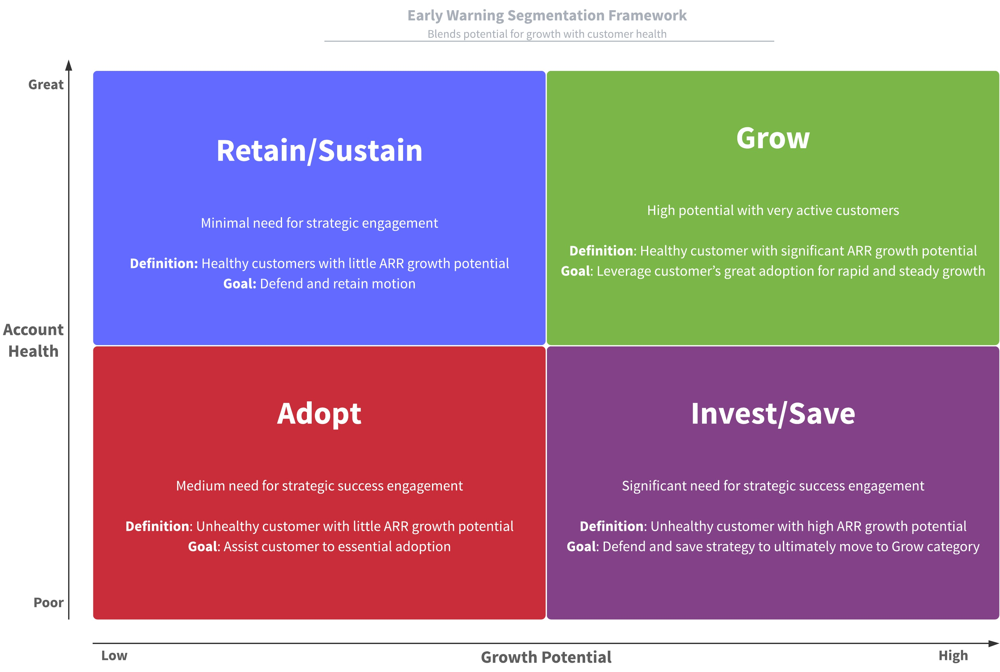
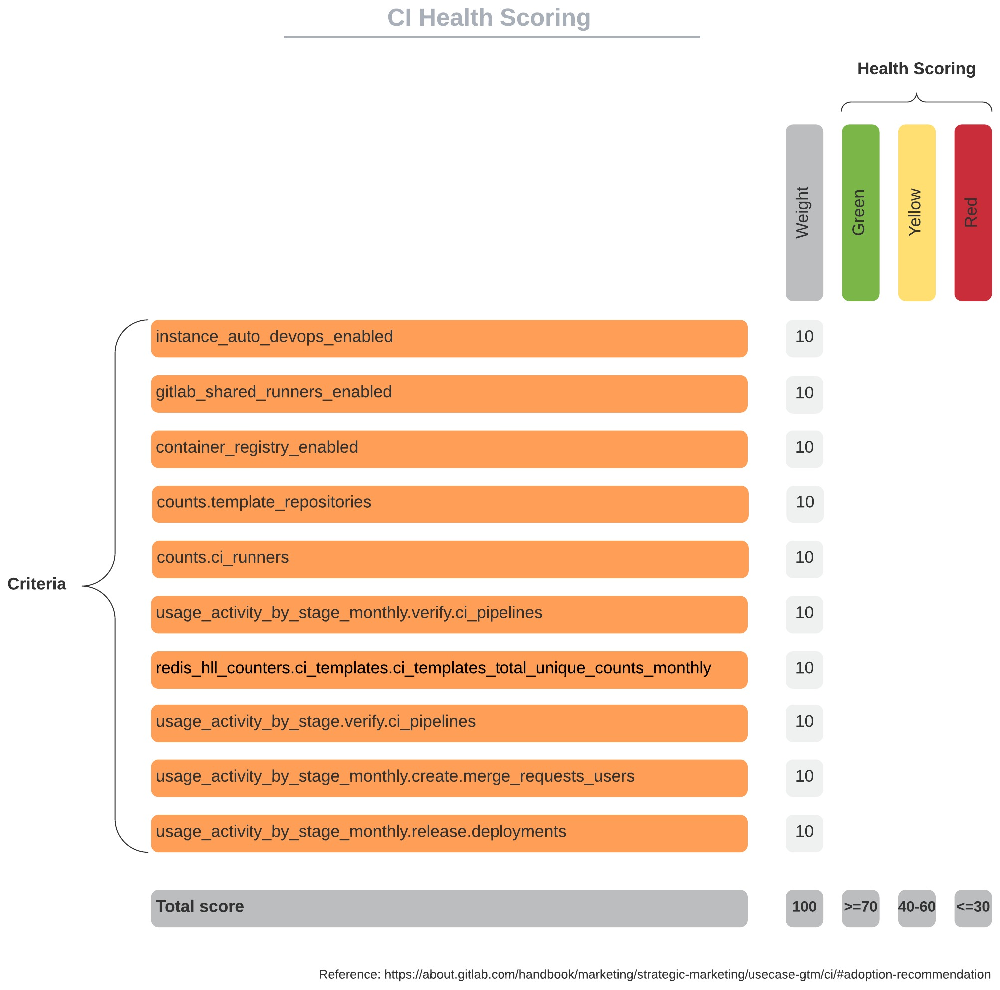

## On this page
{:.no_toc .hidden-md .hidden-lg}

- TOC
{:toc .hidden-md .hidden-lg}

{::options parse_block_html="true" /}

---

# Purpose

The Customer Health Score assists GitLab Account Teams in understanding the relative health of customers for the purposes of predicting expansion, retention, and churn. 

This will be leveraged for the Early Warning System (EWS) as it is a work in progress, starting in FY22-Q2 and expected to take multiple quarters to achieve the overall objective. Future state will include LAM for expansion potential.

## Account Health Predictor

Account Health is an aggregation of key metrics for a multi-perspective view of the customer to be used to predict the customer’s likelihood to:

- Expansion
- (Flat) Renewal
- Downgrade
- Churn

For instance, the customer may have deployed all their subscription licenses but aren’t actively using them; or they may be using them, but all their Support tickets are very negative. 

Looking through just one lens provides a limited view. On a happier note, the customer may have deployed most of their licenses, are heavily using all the current tier’s high end features, and are hitting business outcomes. In that case, their milestones indicate expansion opportunities. We will need to PROVE value to the customer and ourselves:

**PROVE**

* **Product**: License activation + User engagement + Use Case: 50% weighting
* **Risk**: TAM Sentiment + Opportunity Renewal risks: 0-50%
* **Outcomes**: Success Plan + Verified Outcomes: 20%
* **Voice**: Support + Surveys: 10%
* **Engagement**: Customer Engagement + Executive Sponsorship + Events + Certifications: 20%

  

### PROVE Components

| **Category**   | **Health Measure**         | **Example**                                                  | **Why?**                                                     | **Metrics**                                                  | **Account Type** | **Maturity** |
| -------------- | -------------------------- | ------------------------------------------------------------ | ------------------------------------------------------------ | ------------------------------------------------------------ | ---------------- | ------------ |
| **Product**    | License Activation         | The customer has assigned all licenses                                            | Has the customer deployed their licenses? This is an indicator of seat reduction / expansion                      | License utilization                                          | All              | 50%          |
| **Product**    | User Engagement            | 73% of users are Monthly Active Users                                         | Are users logging in and using the product?                  | Unique Monthly Active Users / billable_user_count               | All              | 50%          |
| **Product**    | Adoption (Use Case)        | Use Case adoption                                            | Is the customer adopting use cases and progressing into “stickier” areas of GitLab? | SCM —> CI —> DevSecOps adoption                              | All              | 30%          |
| **Risk**       | TAM Sentiment              | The sentiment as determined by the TAM, if applicable        | What has the TAM determined from cadence calls?              | TAM Sentiment                                                | TAM owned        | 100%         |
| **Outcomes**   | ROI Success Plan           | Ensure the ROI Success Plan is aligned to customer           | A missing or poorly constructed Success Plan highlights a lack of alignment between GitLab and customer desired outcomes. | Green Success Plans Delivered EBRs                           | TAM owned        | 100%         |
| **Outcomes**   | Verified Business Outcomes | Completed Success Plan Objectives                            | Failed or missed PBOs can be a sign of distress; successful PBOs can highlight renewal expansion | Successfully completing at least one VO each year            | TAM owned        | Not started  |
| **VoC**        | Support - Escalations      | Severity 1 or 2 tickets                                      | If there are severity 1 or 2 tickets, that can indicate unhappiness or frustration | Measure if there are Sev1 tickets in the last 180 days or Sev2 tickets in the last 90 days | All              | Not started  |
| **VoC**        | Support - Engagement       | Customer sends in tickets                                    | Determining if the customer is engaged with Support          | Retain existing methodology, but tweak to allow more tickets as a good thing | All              | 100%         |
| **VoC**        | Support - CSAT             | Customer completes CSAT surveys and provides feedback        | Is the customer giving feedback and what are the scores (response + outcomes) | Benchmark a minimum XX% response rate for green health and provide CSAT results to TAM | All              | Not started  |
| **VoC**        | NPS Surveys                | The customer responds to and provides high scores            | Because surveys are a good indicator of the customer’s perception of the product and company; this can | Survey responses rates + survey scores                       | All              | Not started  |
| **Engagement** | Engagement                 | Recency of TAM cadence call                                  | Lack of customer engagement                                  | Date of last TAM cadence call                                | TAM owned        | 100%         |
| **Engagement** | Executive Sponsorship      | Are stakeholders aligned and communicating?                  | Lack of alignment and communication can indicate a disconnect between execs and ROI | Recency of aligned stakeholder communication                 | TAM owned        | Not started  |
| **Engagement** | Events                     | Is the customer attending GitLab events?                     | Event attendance indicates customer engagement, dialogues with team members, and face-to-face interactions | TBD                                                          | All              | Not started  |
| **Engagement** | Certifications             | Are users within the account taking certifications? Are they maintaining their certifications? | Obtaining GitLab certifications is a positive for us and the customer; it also indicates their involvement in GitLab, knowledge of using GitLab, and provides an inference as an internal champion | TBC                                                          | All              | Not started  |

### Health Score Commentary and Uses

The Account Health Score does and will include many factors with different weightings per group and per individual measure with the goal being a multi-perspective approach, measuring what matters to the customer, and measuring the features that they have access to and can utilize. 

<u>Note</u>: if data is missing for any health measure, it is counted as `NULL` instead of a value (i.e., red).

<u>Tier-based Product Usage Data</u>: will evaluate the customer’s usage based on their current tier and feature access. For example, if a customer is on Premium, we will base their health on Premium-level features to understand their level of adoption. If their health is red or yellow, it signifies risk. If green, it can signify expansion or flat renewal.

<u>Leading and lagging indicators</u>: Some metrics are more leading or lagging indicators. While we will lean toward a predictive solution, lagging metrics are incorporated to assess past performance.

The following graph (Early Warning Segmentation Framework) is used to provide a framework for which strategy to use and which resources to leverage. Customers are grouped by their Account Health and growth potential. Renewal Operations Analysts will support the Field in triaging accounts to identify where to spend their time.

 

 

# Success Criteria

For a fuller list of the project roadmap, see [Product Usage Data Roadmap](https://docs.google.com/presentation/d/1_v4hxKdbL6--UjpjVdveGEGD_MjmUnBg0-OIU1R14m8/edit#slide=id.gbc45c07eca_0_135).

## FY22

- Basic Customer Health Scoring to describe the health of the customer at that point in time for 80%+ of customers
- Auto-enroll digital customers in campaigns based on usage
- Data is available to all GTM teams via Gainsight and Salesforce

## FY23

- Advanced metrics and methodology to move from reactive to proactive account management
- Identify protect/expand initiatives based on usage. If certain customers are underutilizing features, launch a protect CTA. If a customer is heavily using features, create an expand CTA.
- Enhanced renewal forecasting capabilities for SMB and potentially Mid-Market segments where reps have a view 2+ quarters out into their renewals with product usage insights and ability to select which levers to pull for a better customer experience

# Methodology 

## Health scoring

### Starting point

The first approach was a calculation of multiple metrics to create a “black box” approach. This was neither helpful to the end user (TAMs, SAs, sales reps), it was not easy to understand the calculation, the Gainsight logic was inadequate, and was not action-oriented to know *which* aspects of the use case were great and which needed improvement.

### Next iteration

The next iteration is a model where each use case incorporates X number of metrics and each metric is valued from 0-1.0. Then, the individual scores can then be summed to an aggregated score for that use case. Below is an *example* of what *could* be done for transparently measuring health.
 

 

Example: CI has ten individual features with one metric per feature and each metric is equally weighted at 10. Each metric can score between 0-10 with some being zero, some being 5, and others being 10. The aggregate score would be 65 out of 100. The TAM could then evaluate each metric to see which features are being adopted and which ones need improvement.

While the product usage health will be summarized, a separate health view will allow users to view each individual component. This allows users to quickly skim overall health and, when applicable, to look into the details to see which features are not being utilized.

## Predictive Analytics

This is not a silver bullet. This will not cure all that ails you. Instead, this methodology is probabilistic and incorporates health measures to correlate the typical journey of “healthy” customers (expand and renew) with “unhealthy” customers (downgrade and churn). For example, a healthy sales pipeline has few pushes (moving the close date) and progressively moves through stages (not stale). Conversely, an opportunity with multiple pushes and stuck in stages for long periods of time is an indicator of risk.

### Appetite and Ability to Expand (Seats, Uptier)

Triggers will be used for different events: 

- A call to action to prevent downgrade because of lack of license utilization
- Heavy CI usage indicates they are meeting their business outcome and are ready to talk about the next stage, or 
- The customer has very little growth but is successful and we should aim for a flat renewal. 

Each of these metrics will be used to guide the account team in knowing when a customer is approaching the next or has met their milestone. The items listed below are examples of what an account team could look at to glean insights for a productive customer conversation.

### Seat Expansion

#### License Utilization

1. Rapidly consuming licenses (measuring growth rates)
2. 90% license utilization

#### User Activity

1. High UMAU (above 80%)

### Uptier

1. Desire for guest users
   1. They purchased a high number of Premium licenses but could move many to Guest
1. Consuming Free/Premium features that lead to Ultimate
   1. DevSecOps
   1. Agile Planning
1. Success Plan objectives are aligned with Ultimate-level feature sets
   1. DevSecOps
   1. Agile Planning

### Seat Reduction

1. Less than 75% license utilization (excludes onboarding customers)
2. Consistent reduction in activated user count (number of deactivated users M-o-M)
3. TAM renewal risk == Seat Loss

### Downtier

1. Not using Ultimate-level features
   1. DevSecOps
   1. Agile Planning
1. Success Plan objectives not aligned with Ultimate-level feature sets
1. TAM renewal risk == downtier

### Churn

Indicators from Seat Reduction or Downtier above plus:

#### Customer Experience

1. Customer has gone dark
2. Loss of internal champion/stakeholder
3. TAM renewal risk == churn

#### Renewal Opportunities

1. Stages not progressing
2. Pushes
3. Lack of Oppty customer activity

## Segmentation

Segmentation will primarily follow the level of service (TAM Priority 1, 2, 3), and secondarily other factors as listed below.

1. TAM-managed vs. non TAM-managed
2. Segmentation: Enterprise, Mid-Market, SMB
3. Geographical
4. Divisional (WW or Public Sector)

# References

- [MVC Early Warning System epic](https://gitlab.com/groups/gitlab-com/sales-team/field-operations/-/epics/25)
- [Customer Analytics Roadmap (internal-only document)](https://docs.google.com/presentation/d/1_v4hxKdbL6--UjpjVdveGEGD_MjmUnBg0-OIU1R14m8/edit#slide=id.gb3e6c0a32e_0_5) (slide deck)
- [Project Compass #3 - GTM Product Analytics - Improve product and customer analytics to capture richer data about users](https://gitlab.com/groups/gitlab-com/-/epics/1246)
- [Project Compass #15 - Build analytics capabilities and CRM integration to improve cross-sell/up-sell](https://gitlab.com/groups/gitlab-com/-/epics/1247)
- [Renewal Operations Strategy (internal only document)](https://docs.google.com/document/d/1cQGAzrpdZyqq7P5X40AZrh-HLvv2PwmHfHcv3iq_2M8/edit#)

