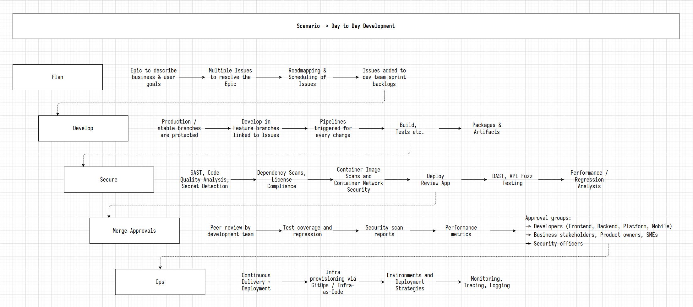

## On this page
{:.no_toc .hidden-md .hidden-lg}

- TOC
{:toc .hidden-md .hidden-lg}

[**SA Practices**](/handbook/customer-success/solutions-architects/sa-practices) - [**Sales Plays**](/handbook/customer-success/solutions-architects/sales-plays) - [**Tools and Resources**](/handbook/customer-success/solutions-architects/tools-and-resources) - [**Career Development**](/handbook/customer-success/solutions-architects/career-development) - [**Demonstration**](/handbook/customer-success/solutions-architects/demonstrations) - [**Processes**](/handbook/customer-success/solutions-architects/processes) - [**Education and Enablement**](/handbook/customer-success/education-enablement)

# Value Stream Assessments
{:.no_toc}

When working with GitLab, many prospects and customers have software delivery performance improvement as a critical business outcome. Unfortunately, due to the inherent and increasing complexity in the software delivery process, an organization's software delivery value stream often consists of dozens, if not hundreds, of manual configuration touch points and handoffs. Usually, there is a lack of understanding and visibility into the current process, making it challenging to identify and measure software delivery improvements. Without understanding the current value stream, organizations risk slower progress in improving their software delivery performance.

Where applicable, GitLab account teams should assist prospects and customers by providing a lightweight assessment of their value stream. The content on this page outlines the approaches, tools, and artifacts used to conduct a value stream assessment for our prospects and customers. By creating a better understanding of the current process by identifying bottlenecks and establishing a baseline measurement of software delivery performance, GitLab can ensure our prospects and customers can realize improvements more quickly and continuously.

## Process

1. [Qualify the Opportunity for a value stream assessment](#qualify)
1. [Educate potential participants and obtain commitment to the exercise](#education-and-commitment)
1. [Facilitate a discovery session and/or conduct interviews](#discovery)
1. [Summarize the findings](#summarize-the-findings)
1. [Stakeholder readout](#stakeholder-readout)
1. [Contribute back to this framework](#how-to-contribute)

### Qualify

Value stream assessments require an investment of time by both the GitLab field teams and our prospects and customers. To ensure the appropriate return on this investment of time, the opportunities should meet the following criteria:

- The account has a total addressable market of at least 1000 GitLab users
- The prospect or customer is focused on improving their software delivery performance
- We have a relationship with stakeholders that have the authority to make a decision on the purchase of GitLab

Key indicators that the opportunity is well-suited include:

- There is a specific initiative to accomplish one or more of the following by a specific date
    - Modernize a specific application or applications
    - Deliver a new critical application to the market
    - Transform or objectively improve their ability to deliver software
    - Modernize their DevOps capabilities
- The customer is currently using some features of GitLab and is interested in how leveraging more of the platform will drive software delivery outcomes

### Education and Commitment

A successful Value Stream Assessment requires a commitment to the exercise by the software delivery stakeholders and the personnel experienced with the various processes that constitute their value stream. Without understanding the assessment process and its value to their organization, key participants will lack the commitment to ensure a successful VSA. Educate the prospect or customer on the benefits, process details, and the required commitment. Leverage the [Value Stream Assessment Pitch Deck](https://docs.google.com/presentation/d/1R8RMrXDIaP9Mz3P0_xcevjDQROtvVpSwtEBJgxdsNbw/edit?usp=sharing) by customizing it for the prospect or customer to assist with this step

_While a Value Stream Assessment is an advanced discovery exercise, it's expected that initial [opportunity discovery](/handbook/sales/playbook/discovery/) and [technical discovery](/handbook/customer-success/solutions-architects/processes/technical-discovery) have been conducted._

#### Key Benefits

- Discovery and documentation of the software delivery value stream or "path to production" currently in place
    - Establish a baseline from which to measure the progress of software delivery performance
    - Identify manual configuration touchpoints and handoffs and other value stream bottlenecks
    - Create a process improvement roadmap
    - Understand the return on investment of a value delivery platform
    - Promote collaboration amongst traditionally siloed functions within the DevSecOps lifecycle

After the prospect or customer understands the process and its benefits, confirm commitment from the stakeholders and exercise participants by scheduling the facilitated exercise and/or interviews. Estimate the duration of the assessment and set the expectation that the documented value stream, recommendations, and readout will be delivered.

#### What is The Required Time Commitment?

Focusing on the goals and benefits listed above, the time required to complete a minimally viable value stream assessment will vary from organization to organization. It is an anti-goal for the exercise to require exhaustive discussion and research. Depending on the availability and commitment of the various value stream participants and stakeholders, the practice could take as little as 4 hours to complete or up to 15 hours spread out through multiple sessions over multiple days. The sessions typically involve different personas per session.

### Discovery

- Facilitation
- Tools
- Workflows
- Questions

#### Facilitation

TODO

#### Tools

- Remote:
    - Mural or Lucid charts for real-time collaboration
    - Zoom, MS Teams, or Google Meet
- Onsite:
    - Stickies
    - Pens
    - Large whiteboard

#### Workflows

1. Idea to Production
1. Response to Production Incident
1. Toolchain Upgrading and Maintenance

##### Idea to Production

##### Response to Production Incident

##### Toolchain Upgrading and Maintenance

#### Questions

Discovery Questions for each worflow:

1. Workflow 01: Idea to Production
    - TODO: Adrian & Michael
1. Workflow 02: Response to Production Incident
    - TODO: Gronk & Sri
1. Workflow 03: Toolchain Upgrading and Maintenance
    - TODO: Simon & Robbie

### Summarize the Findings

### Stakeholder Readout

## How to Contribute

In the spirit of collaboration and iteration, please help to continuously improve this framework. Ways to contribute include:

- Create a merge request to improve this page
- Add feedback or tasks to the [Value Stream Assessment Issue](https://gitlab.com/gitlab-com/customer-success/solutions-architecture-leaders/sa-initiatives/-/issues/44)
- Share your experiences in the **#customer-success** and **#solutions-architects** slack channels
- Provide feedback and/or updates to the pitch deck or provide links to your own variations
- Provide links to your facilitation recordings, summary documentation, and/or other artifacts to this page
- Collaborate in the **#value-stream-discovery** slack channel
