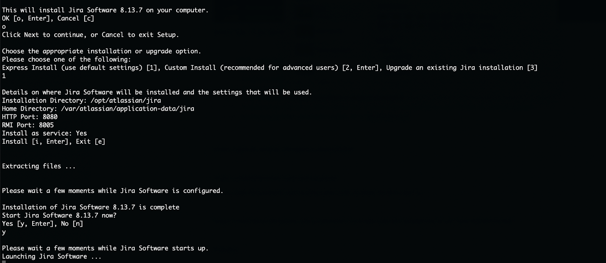
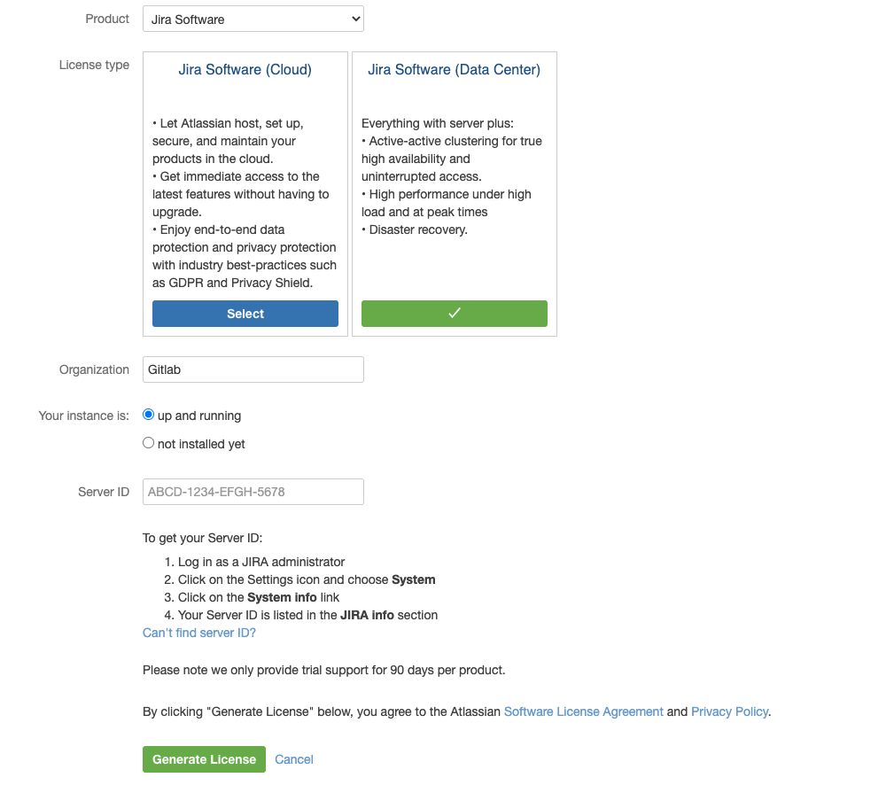
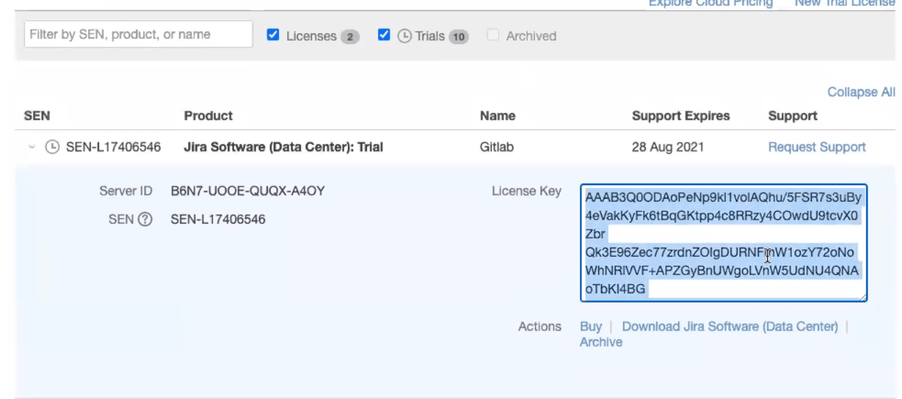
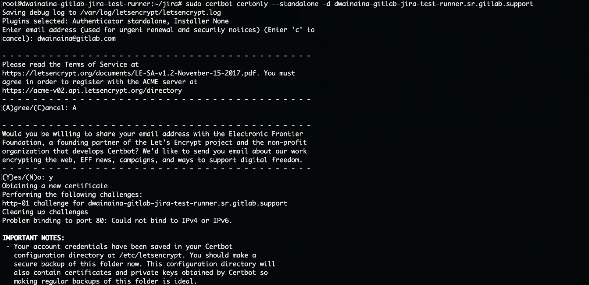

## On this page

{:.no_toc .hidden-md .hidden-lg}

- TOC
{:toc .hidden-md .hidden-lg}

### What is Jira Software

Jira Software is part of a family of products designed to help teams of all types manage work. Originally, Jira was designed as a bug and issue tracker. But today, Jira has evolved into a powerful work management tool for all kinds of use cases, from requirements and test case management to agile software development. 

For more information about various uses of Jira Please check out the [Get started with Jira Software](https://www.atlassian.com/software/jira/guides/getting-started/basics)

### How to Set Up Jira Server

1. You need to create an instance from the [Support-resources](https://gitlab.com/gitlab-com/support/support-resources/). Ensure nothing is using port 443. We will set up Jira to use HTTPS for Gitlab integration. 

#### Prerequisite software:
- You need to install Java as Jira uses java JVM.
- You need to install certbot, python3-certbot-apache for you to generate certificates for HTTPS

#### Installing Jira and prerequisites: 

1. Install Java because Jira uses Java JVM

   ```bash
   apt install openjdk-11-jdk  openjdk-11-jre
   ```
<<<<<<< HEAD

=======
1. Install certbot, python3-certbot-apache to generate certificates for HTTPS
>>>>>>> 1eee2789a1e9b9e2bc0d93039389fe6fe950dec2
1. Create a folder to store Jira software for installation. 

   ```bash
   mkdir  jira && cd jira
   ```

1. Choose the version of Jira that you want to download from [Atlassian Jira Website](https://www.atlassian.com/software/jira/update).

   We will be using the  Jira 8.13 version so that we can test all supported GitLab integrations. However, this will not work for OAuth2.0  integration so we will later upgrade Jira to test the connection.

  1. Select the Jira version that you want to download. 

   

  1. Accept and right-click submit button to get the download URL. (Choose copy link address during the file download)

1. Use `wget <URL>` command to download the Jira installer. Example:

   ```bash
   wget https://www.atlassian.com/software/jira/downloads/binary/atlassian-jira-software-8.13.7-x64.bin
   ```

   

1. Change the script to be executable using

   ```bash
   chmod a+x atlassian-jira-software-8.13.7-x64.bin
   ```

1. Run the installer and enter Y if it requests you to install OpenJDK. 

   ```bash
   sudo ./atlassian-jira-software-8.13.7-x64.bin
   ```

   

1. Follow the installation instructions and enter default for all questions asked in the installation.

   

1. Run Jira setup. You will activate a 30 day trial period. Select set up Jira manually. 
1. You now have Jira setup and accessible in your localhost:8080.
1. You will have to set up Jira before using it. After you access from the browser, Select `I’II set it up myself`.

   

1. In the next step, select `Built-in (for evaluation or demonstration)`.  

   

1. While waiting for the database to be created,  login to your atlassian account and open https://my.atlassian.com/product .  Generate a license trial license for your server. 

    

2. On the next page, select `Jira Software` for Product and  `Jira Software (Data Center)` for License type.  Enter any details for the remaining fields.  For `Server ID`, you will get it when the server finishes setting up the database. 

   

1. After the database creation is complete, the next section will be setting application properties. Leave it as default and click `Next`.
   
   

1. Copy and paste the license key generated and update license in your Jira setup. 
   
   

   

2. Create a Jira Admin user and continue with the next steps. 
3. Continue with the setup and create a test project.  “GITLAB”. 
4. Create a test issue that we will be using to test with. 

#### Adding a lets-encrypt certificate to enable HTTPS connection 

NOTE: 
HTTPS connection is **required** for DVCS Connector

1. Install certbot to enable you to generate the certificate

   ```bash
   sudo apt-get update && apt-get upgrade
   sudo apt-get install certbot
   ```

   Optionally, you can install the Certbot Apache plugin:

   ```bash
   sudo apt-get install python3-certbot-apache
   ```

1. Generate a certificate for your domain. Input your e-mail when prompted.

   ```bash
   sudo certbot certonly --standalone -d www.example.com
   ```

   

1. If everything goes fine. A new SSL will be issued at the below location. Navigate to the below directory and view files.

   ```bash
   cd /etc/letsencrypt/live/example.com
   ls
   ```

   You should be able to see the following list:

   - cert.pem
   - chain.pem
   - fullchain.pem
   - privkey.pem

   NOTE:
   In case you get a `Problem binding to port 80: Could not bind to IPv4 or IPv6.` error, check the PID of the application using port 80 then stop the application running on that port and retry generating the certificates. 

   

   ```bash
   # Check with lsof 
   lsof -i :80

   # You can also use
   netstat -antlup | grep 80

   # If it's Apache, you can run the following:
   systemctl stop apache2
   systemctl disable apache2
   ```

#### Convert keypair and certificate to Java Keystore

NOTE:
I will be using `dwainaina-gitlab-jira-test-runner.sr.gitlab.support` as my domain for the rest of the examples. 

1. Create a PKCS12 that contains both your full chain and the private key. You need to have OpenSSL installed for that.

   ```
   openssl pkcs12 -export -out /tmp/dwainaina-gitlab-jira-test-runner.sr.gitlab.support.p12 \
      -in /etc/letsencrypt/live/dwainaina-gitlab-jira-test-runner.sr.gitlab.support/fullchain.pem \
      -inkey /etc/letsencrypt/live/dwainaina-gitlab-jira-test-runner.sr.gitlab.support/privkey.pem \
      -name tomcat
   ```

   Replace the values accordingly. For `name`, we put it `tomcat` you may change the alias to anything you like but please remember this name.

1. Copy the generated JKS file to /opt/atlassian/jira/conf

   ```bash
   cp /tmp/dwainaina-gitlab-jira-test-runner.sr.gitlab.support.jks  /opt/atlassian/jira/conf/
   ```

1. Change directory to `/opt/atlassian/jira/conf/` and edit the `server.xml`

   ```bash
   cd /opt/atlassian/jira/conf
   vim server.xml
   ```

1. Comment out to disable HTTP.

   ```
    <!--
           <Connector port="8080" relaxedPathChars="[]|" relaxedQueryChars="[]|{}^&#x5c;&#x60;&quot;&lt;&gt;"
                      maxThreads="150" minSpareThreads="25" connectionTimeout="20000" enableLookups="false"
                      maxHttpHeaderSize="8192" protocol="HTTP/1.1" useBodyEncodingForURI="true" redirectPort="8443"
                      acceptCount="100" disableUploadTimeout="true" bindOnInit="false"/>
            -->
   ```

1. Add the following before the closure of service block in `server.xml`

   ```
   <Connector port="443" protocol="org.apache.coyote.http11.Http11NioProtocol"
                 maxHttpHeaderSize="8192" SSLEnabled="true"
                 maxThreads="150" minSpareThreads="25"
                 enableLookups="false" disableUploadTimeout="true"
                 acceptCount="100" scheme="https" secure="true"
                 sslEnabledProtocols="TLSv1.2,TLSv1.3"
           clientAuth="false" useBodyEncodingForURI="true"
           relaxedPathChars="[]|" relaxedQueryChars="[]|{}^&#x5c;&#x60;&quot;&lt;&gt;"
                 keyAlias="tomcat" keystoreFile="conf/dwainaina-gitlab-jira-test-runner.sr.gitlab.support.jks" keystorePass="Jira_PASSWORD" keystoreType="JKS" />
       </Service>
   ```

   Replace the values for your `keyAlias`, `keystoreFile` and `keystrokePass` accordingly.

1. Edit the `web.xml` in conf folder and add the following so that all requests will be handled using the HTTPS

   ```
   <security-constraint>
     <web-resource-collection>
       <web-resource-name>all-except-attachments</web-resource-name>
       <url-pattern>*.jsp</url-pattern>
       <url-pattern>*.jspa</url-pattern>
       <url-pattern>/browse/*</url-pattern>
       <url-pattern>/issues/*</url-pattern>
    </web-resource-collection>
     <user-data-constraint>
       <transport-guarantee>CONFIDENTIAL</transport-guarantee>
     </user-data-constraint>
   </security-constraint>
   ```

1. **Optional**: [Specify Jira home directory](https://confluence.atlassian.com/adminjiraserver/setting-your-jira-application-home-directory-938847747.html) if it is not at default location: 

   ```bash
   vim <installation-directory>/atlassian-jira/WEB-INF/classes/jira-application.properties
   jira.home = /PATH/TO/JIRA-HOME
   ```

1. Restart tomcat and check if the site is available in HTTPS.

   **NOTE:**
   HTTPS port might not be accessible after you restart tomcat.  Run the following command to enable port and apply settings:

   ```bash
   echo 'net.ipv4.ip_unprivileged_port_start=0' > /etc/sysctl.d/50-unprivileged-ports.conf
   sysctl --system
   ```

1. The site should now be available as a HTTPs address. Use the credentials you used to configure to now log in. 

### Common Troubleshooting Steps for Jira tickets

1. Please check out the common known errors listed in our documentation: [Jira - Troubleshooting](https://docs.gitlab.com/ee/integration/jira/#troubleshooting) and [Troubleshooting your DVCS connection](https://docs.gitlab.com/ee/integration/jira/dvcs.html#troubleshooting-your-dvcs-connection)
1. Clarify with customers with integration they are referring to - we have GitLab Jira Integration and Jira Development Panel integration. 
1. It is also helpful to get their Jira version - particularly: Cloud or Server? Is Server which version? (Note: 8.14 later [links differently](https://confluence.atlassian.com/adminjiraserver/linking-gitlab-accounts-1027142272.html))
1. Check their configuration, walk through the steps. 
   **NOTE**: 
   Some customers confused the configuration of the two integrations, for example using the `jira` user created in GitLab Jira Integration as the Term/Account for setting up DVCS account for their Jira Development Panel. This will load the repo of the `jira` user’s personal namespace which usually has 0 repos. 
1. If all the configurations are correct, we might need to get the logs depending on where the error is occurring, they might need to check the [log files on Jira](https://confluence.atlassian.com/jirakb/useful-log-files-in-jira-1027120387.html ), they can `tail JIRA_HOME/log/atlassian-jira.log` while reproducing the error. If it's `Jira DVCS connection has wrong oauth scope: Issue when integrating with Jira DVCS`, check out [the workaround](https://docs.gitlab.com/ee/integration/jira/dvcs.html#scope-error-when-connecting-jira-via-dvcs).
1. We also have a list of useful [Rails cheat code](https://gitlab.com/gitlab-org/gitlab/-/blob/master/doc/administration/troubleshooting/gitlab_rails_cheat_sheet.md#bulk-update-to-change-all-the-jira-integrations-to-jira-instance-level-values), this is handy when we need to check the values of the Jira configurations on GitLab.

